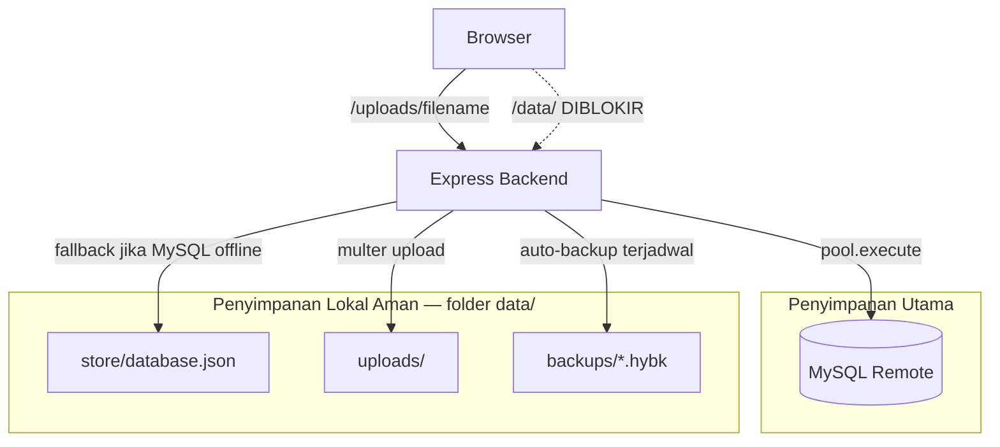

# Hyrost — Sistem Penyimpanan Data

## Arsitektur



## Lapisan penyimpanan

| Lapisan | Lokasi | Persisten | Keamanan |
|---------|--------|-----------|----------|
| **MySQL** | Server remote (`DB_*` di `.env`) | ✅ | Kredensial di `.env`, tidak di-commit |
| **Local store** | `data/store/database.json` | ✅ | Permission 600, path traversal blocked |
| **Uploads** | `data/uploads/` | ✅ | Random filename, whitelist ekstensi, served via route aman |
| **Backups** | `data/backups/*.hybk` | ✅ | AES-256-GCM, key dari `JWT_SECRET` |
| **RAM sementara** | `global.minecraftStatus`, SSE | ❌ | Hanya cache realtime |

## Folder `data/`

Dibuat otomatis saat server start:

```
data/
├── store/      ← fallback DB (JSON) saat MySQL tidak tersedia
├── uploads/    ← gambar user (forum, marketplace, dll.)
├── backups/    ← snapshot MySQL terenkripsi
└── cache/      ← file sementara
```

**Folder `data/` tidak bisa diakses publik** — diblokir di `backend/app.js`.

## Mode operasi

### Normal (production)
- MySQL terhubung → semua data CRUD ke database remote
- Auto-backup lokal setiap 24 jam ke `data/backups/`
- Upload file ke `data/uploads/`

### Fallback (MySQL offline)
- Data disimpan ke `data/store/database.json`
- Perubahan di-sync otomatis (debounce 2 detik)
- **Data tetap ada setelah restart server**
- Saat MySQL kembali online, data fallback **tidak** auto-merge — restore manual jika perlu

## Upload file

- Path: `data/uploads/{random-hex}.{ext}`
- Max: 5 MB
- Format: JPG, PNG, GIF, WEBP
- URL publik: `/uploads/{filename}` (via route aman, bukan static folder)
- Filename lama dari folder `uploads/` root otomatis dimigrasi

## Backup otomatis

| Env | Default | Fungsi |
|-----|---------|--------|
| `LOCAL_BACKUP_ENABLED` | `true` | Aktif/nonaktif backup |
| `LOCAL_BACKUP_INTERVAL_HOURS` | `24` | Interval backup |
| `LOCAL_BACKUP_KEEP` | `7` | Jumlah file backup disimpan |
| `LOCAL_BACKUP_ENCRYPT` | `true` | Enkripsi AES-256-GCM |
| `LOCAL_BACKUP_KEY` | (JWT_SECRET) | Key enkripsi custom |

Backup berisi: users, roles, settings, cosmetics, wiki, vouchers, quests, catalog, IP blacklist, threads (500), tickets (500).

### Restore manual

1. Stop server
2. Decrypt backup (butuh script atau key yang sama)
3. Import data ke MySQL via Admin Panel → Backup → Restore JSON

## Variabel `.env`

```env
LOCAL_DATA_DIR=data
LOCAL_STORE_SYNC=true
LOCAL_BACKUP_ENABLED=true
LOCAL_BACKUP_INTERVAL_HOURS=24
LOCAL_BACKUP_KEEP=7
LOCAL_BACKUP_ENCRYPT=true
```

## Rekomendasi production

1. **Jangan commit** folder `data/` ke git (sudah di `.gitignore`)
2. **Backup off-site** — otomatis ke Google Drive (`GOOGLE_DRIVE_ENABLED=true`) atau salin `data/backups/` manual

Panduan Drive: [`docs/GOOGLE_DRIVE_SETUP.md`](GOOGLE_DRIVE_SETUP.md)
3. **Permission folder** — `chmod 750 data/` di Linux VPS
4. **MySQL tetap utama** — local file hanya cadangan & fallback
5. Set `LOCAL_BACKUP_KEY` unik jika ingin key enkripsi terpisah dari JWT

## Log startup

```
📁 Local data directory: D:\Website\HYROST web\data
✅ MySQL Database Connected Successfully!
🗄️  Storage mode: MySQL (primary)
💾 Local auto-backup enabled (every 24h → data/backups/)
```
